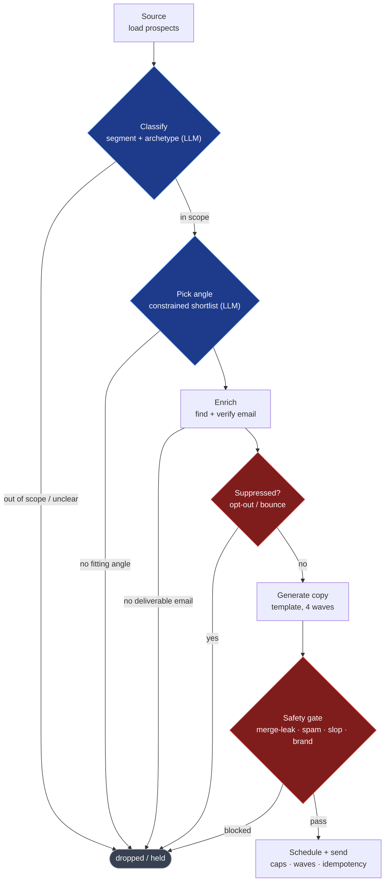

# Autonomous Outreach Agent

[](https://github.com/Samar-Bons/autonomous-outreach-agent/actions/workflows/ci.yml)

A reference implementation of an autonomous, safety-gated B2B cold-outreach agent.

It sources prospects, uses LLMs to decide who to pitch (and who to leave alone),
generates grounded per-prospect copy, runs every draft through a deterministic
safety gate, schedules multi-touch email sequences inside hard compliance and
deliverability guardrails, and drafts grounded replies to inbound email. It is
built to run unattended without ever sending the wrong thing to a stranger.

> **Thesis:** an LLM that touches the real world is a safety-critical system.
> The LLM does the reasoning; deterministic code holds the guarantees. No safety
> property is ever allowed to depend on the model being right.

This is a clean-room reference build modeled on a real production system.
Company, data, and contacts here are synthetic. Nothing in this repo targets a
real business or a third-party service.

---

## Highlights

- A deterministic safety envelope around every model call: opt-out suppression, a pre-send draft gate, warmup caps, and idempotency keys. No safety property depends on the model being right.
- Real eval numbers from live Claude runs, reported straight: the safety metrics land at 1.000, accuracy at 0.825 (classification) and 0.679 (angle fit). Not stub-inflated.
- Strict typing (`pyright` strict), 192 tests, and CI that runs lint, types, and the full suite with no API key.
- One agentic component, an inbound responder on the Claude Agent SDK; the orchestrator stays plain deterministic Python by choice.
- Five production failure modes written up in [LESSONS.md](./LESSONS.md), each pinned by a regression test.

## Why this exists

Getting a model to write a good cold email is easy. The hard part is the machine
around the model: knowing who *not* to email, catching opt-outs every time,
never leaking a template variable or pitching the wrong product, respecting send
caps, and being safe to leave running unattended. That machine is most of the
engineering, and it is what this repo shows.

## The pipeline



Blue nodes are LLM reasoning (classify, pick angle). Red nodes are the
deterministic safety gates (the suppression check and the draft gate).
Everything else is plain code. A prospect is dropped at any branch it fails:
the system would rather send nothing than send the wrong thing.

The orchestrator that runs these stages is **plain deterministic Python, by
design**. The model lives only inside classify and angle selection; copy is
deterministic template rendering, and the model is never in the control loop.
Letting an LLM drive orchestration is the failure mode this architecture exists
to avoid.

## Inbound: the one agentic component

Replies are handled by a grounded responder built on the **Claude Agent SDK**.
It is restricted to two in-process knowledge-base tools (search + a
reference-customer allowlist) and drafts a strict-JSON reply that a human
approves before anything sends. Deterministic guards wrap the model: an opt-out
short-circuits to suppression before any model call, and a draft that quotes a
price or names a customer off the allowlist is downgraded to a human escalation.
The agent SDK is an optional dependency (`.[agent]`).

## Evals

The model-driven stages get eval suites on top of unit tests. The
deterministic-subject evals (opt-out, draft gate) measure code and run anywhere;
the model-subject evals (classification, angle, inbound agent) run against live
Claude via each eval's `--live` flag. The figures below are **real live runs**
(2026-06-03), not stub numbers
([full report](./evals/reports/EVAL_REPORTS_LIVE.md)):

| Eval | Subject | Real figure |
|---|---|---|
| Classification + quarantine | live Haiku, n=40 | archetype acc 0.825; **pitch precision 1.000, quarantine recall 1.000** |
| Opt-out detection | deterministic, n=20 | **recall 1.000** (the CAN-SPAM line), precision 1.000 |
| Draft safety-gate | deterministic, n=18 | detection 1.000, 0 false positives |
| Angle-pick quality | live LLM-as-judge, n=24 | mean 0.679 (surfaced 8 weak picks to fix) |
| Inbound responder | live Agent SDK, n=10 | opt-out recall 1.000; **0 price / name-drop leaks** in approved drafts |

The story these tell: accuracy is honest (0.825 archetype, 0.679 angle fit), and
the **safety-critical metrics are the ones that come out perfect**. The angle
eval doing its job and flagging 8 weak picks is a feature, not a blemish; it is
the next iteration's worklist.

**The knobs that produced these figures are redacted.** The prompts and tuning
behind the model-driven numbers are proprietary and stripped to placeholders in
this public build, so re-running `--live` on the stub prompts will not reproduce
them. What is here and fully reproducible: the eval harness, the labeled golden
sets, and the deterministic evals (opt-out, draft gate), which depend on no
redacted knobs.

## Quickstart

```bash
uv venv && uv pip install -e ".[dev,agent]"
pytest                  # 192 unit/integration/e2e tests, stub LLM, no API key
python -m evals.run_all # regenerate the eval report
outreach run-demo       # run the whole pipeline on synthetic seed data
```

`outreach run-demo` on the 20-row synthetic seed prints the funnel:

```
prospects sourced:   20
quarantined:         4
no angle / no email: 0 / 1
suppressed (skipped): 0
drafts generated:    60
drafts blocked:      0
scheduled / sent:    60 / 60
```

To run the model-driven stages, evals, or the inbound agent for real, copy
`.env.example` to `.env`, set `ANTHROPIC_API_KEY`, and use the `--live` flags or
`pytest -m live`.

## Docs

- [ARCHITECTURE.md](./ARCHITECTURE.md): the design, the SOLID seams, and how the "LLM reasons, code guarantees" split is enforced in the type system.
- [LESSONS.md](./LESSONS.md): five production failure modes and the regression tests that guard them.
- [CONTRIBUTING.md](./CONTRIBUTING.md): setup and the checks CI enforces.
- [CHANGELOG.md](./CHANGELOG.md): release notes.

## What's real and what's synthetic

Real: the architecture, every stage's logic, the safety gates, the evals, the
Agent SDK integration, strict typing, and the test suite. Synthetic: the
company, the prospect data, the knowledge base, and the email addresses. No
scrapers target any real site; the data-acquisition layer reads a CSV.

Deliberately omitted: the email copy (`templates.json`), the prompt text, and
the voice guide are redacted to placeholders. The copy and prompts are
proprietary, so this repo demonstrates the architecture, safety framework, eval
harness, and tests, not the production content. The system runs end to end on
the placeholders.

## License

MIT. See [LICENSE](./LICENSE).
